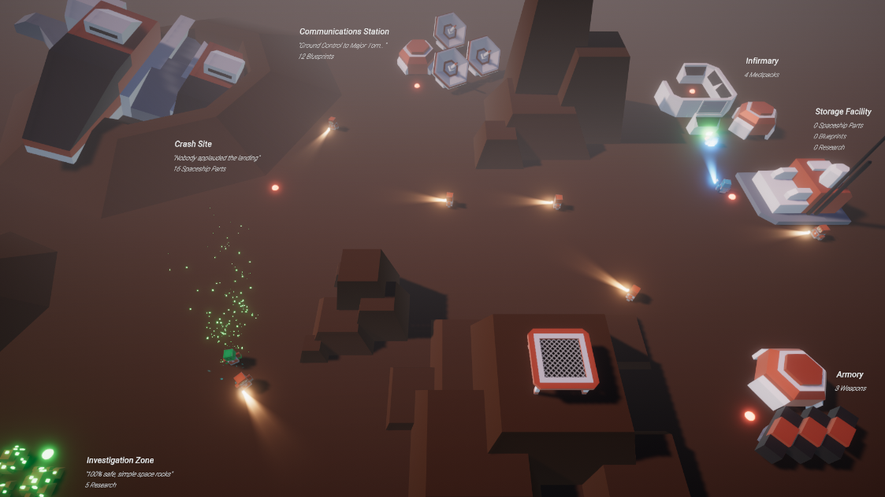

# AI-SpaceVirus-GOAP

Crea un proyecto GOAP en el que un conjunto de agentes lleven a cabo una serie de acciones que les permitan alcanzar sus objetivos. La temática es totalmente libre, por ejemplo se puede simular un pueblo con agentes de todo tipo (cocineros, panaderos, granjeros, mineros, herreros, banqueros, vendedores, ladrones, alguaciles, bomberos, ...). Como referencia, un proyecto con 3 tipos de agentes y 6 acciones en total es un aprobado. A partir de ahí,  se calificará en función de la complejidad del mismo. 

He optado por simular un asentamiento espacial tras un aterrizaje forzoso en un planeta desconocido. Nos encontraremos con agente como Tripulantes, Doctores, Soldados y finalmente los Aliens (Zombies).

---

**Las zonas y sus recursos**

Nos encontraremos con seis diferentes zonas:
1) **Lugar del accidente:** donde se pueden recoger *piezas de la nave espacial*.
2) **Estación de comunicaciones:** donde podremos obtener *planos*.
3) **Zona de investigación**: donde se conseguiremos *investigaciones* y donde nuestros tripulantes pueden ser infectados (según un tanto por ciento dado) por esporas alienígenas, convirtíendolos en zombies espaciales.
4) **Facilidad de almacenamiento**: módulo donde guardaremos las piezas, planos e investigaciones.
5) **Enfermería**: lugar donde se almacenan los *medipacks*. En principio esta zona se iba a utilizar como zona de recuperación de salud de los tripulantes y soldados, no obstante, dada la complejidad que se fue generando con el resto de agentes, decidí descartar la idea de puntos de salud y ceñirme a un comportamiento más instantáneo.
6) **Armería**: donde se almacenan las armas y los tripulantes pueden armarse para convertirse en soldados.

Cada edificio posee su propio **Inventory** con sus correspondientes recursos y tienen la capacidad de regenerarlos en el tiempo.

Además, para la gestión de recursos, se priorizará la recolección de cierto recurso en función de su escasez en la facilidad de almacenaje a través de un **Cost Manager**, el cual modificará los costes de las acciones de los agentes para reflejar este comportamiento.

**Los agentes y sus acciones**

**Tripulante**: encargado de recuperar piezas de la nave espacial, planos y realizar investigaciones. Su objetivo es ir a las zonas designadas y llevar los recursos a la facilidad de almacenamiento. Posee una estado de alerta, pudiendo estar normal, en pánico o alentado) Sus acciones son:
1) Recoger piezas de nave espacial del lugar del accidente.
2) Llevar piezas de nave espacial a la facilidad de almacenamiento. <Meta>
3) Recoger planos de la estación de comunicaciones.
4) Llevar planos a la facilidad de almacenamiento. <Meta>
5) Realizar investigaciones en la zona de investigación. (Aquí puede ser infectado y convertirse en el agente Alien).
6) Llevar la investigación a la facilidad de almacenamiento. <Meta> **<Interrupción>**
7) Pánico. (Tras ser confrontado por un Alien, podrá entrar en pánico y correr a una ubicación aleatoria) <Meta>
8) Equipar equipo de soldado. (Tras ser confrontado por un Alien, podrá sentirse alentado y correr a equiparse el equipo de soldado (siempre que haya armas), convirtiéndose en el agente Soldado). <Meta> **<Interrupción>**
  
Tanto Pánico como Equipar equipo de soldado interrumpen el plan actual para poder actuar y responder ante la amenaza inmediata.
  
**Doctor**: encargado de crear Medipacks (utilizando 1xPieza de nave espacial, 1xPlano y 1xInvestigación) con los recursos de la facilidad de almacenaje. A diferencia de los tripulantes, el doctor no recoge materiales de las diferentes zonas.
1) Recoger recursos de la facilidad de almacenamiento. 
2) Crear Medipack. (en la enfermería) <Meta>
3) Pánico. (Tras ser confrontado por un Alien, podrá entrar en pánico y correr a una ubicación aleatoria) <Meta>  **<Interrupción>**
  
**Alien**: tras transformarse en un alien, el agente deambulará, yendo de zona a zona, en busca de comida. Tras detectar a un astronauta le perseguirá hasta convertirlo o hasta que un soldado le pare los pies.
1) Deambular. <Meta>

  
  

  
